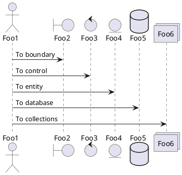
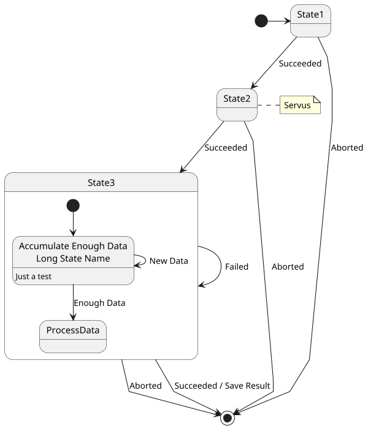

# NP Calculation

## Single Loss

### Criteria for packaging
BlaBla

|Field|
|:---|
|LossId|
|ContractId|
|CoverId|
|OccurrencePeriodStart|
|OccurrencePeriodEnd|
|UnderwritingPeriodStart|
|UnderwritingPeriodEnd|

### Criteria for Current State Selection
Following fields of existing Gross Postings have to be selected.

|Field|
|:---|
|EntryCode|
|LossId|
|Cedent|
|ClassOfBusiness|
|TypeOfBusiness|
|UnderwritingArea|
|LineOfBusiness|
|AsOf|
|CurrencyTranslationDate|
|OccurrencePeriodStart|
|OccurrencePeriodEnd|
|UnderwritingDate|
|ContractId|
|RiskId|
|CoverId|
|Amount|
|Currency|

### Criteria for Sorting within a functional package
The existing Gross Postings and the newly delivered Gross Postings have to be sorted to avoid unnecessary re-bookings 
and to ensure that the calculation is replicable. 

|Sort Order|Field|
|:---|:---|
|1|EntryCode (from Amounts Covered)|
|2|Cedent|
|3|ClassOfBusiness|
|4|TypeOfBusiness|
|5|UnderWritingArea|
|6|LineOfBusiness|
|7|AsOf|
|8|CurrencyTranslationDate|

